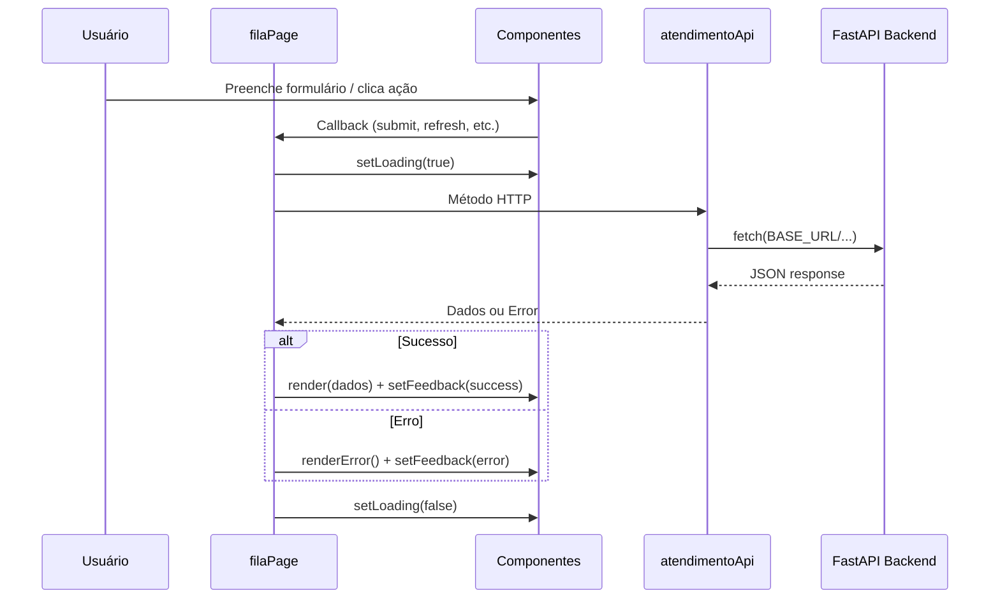

# Documentação do Frontend — AtendeMax

> Sistema de gerenciamento de fila de atendimento. Este documento descreve a estrutura, arquitetura, funcionalidades e integrações do frontend do projeto AtendeMax.

---

## 1. Visão geral

O **AtendeMax Frontend** é uma aplicação web **vanilla** (HTML, CSS e JavaScript puro), sem frameworks como React, Vue ou Angular. Ela consome uma API REST desenvolvida em **FastAPI** (repositório separado: [atendemax-backend](https://github.com/AtendeMax/atendemax-backend)).

### Propósito

Permitir que operadores de atendimento:

- Cadastrem clientes na fila (normal ou preferencial)
- Visualizem a fila de espera em tempo real
- Chamem o próximo cliente
- Cancelem atendimentos pendentes
- Concluam atendimentos em andamento
- Consultem o histórico de atendimentos com filtros

### Stack tecnológica

| Camada        | Tecnologia                          |
|---------------|-------------------------------------|
| Estrutura     | HTML5                               |
| Estilo        | CSS3 (sem preprocessador)           |
| Lógica        | JavaScript ES6+ (módulos via IIFE)    |
| Build         | Nenhum — arquivos servidos estaticamente |
| Dependências  | Nenhuma (zero npm/package.json)     |
| Backend       | FastAPI em `http://127.0.0.1:8000`    |

---

## 2. Estrutura de diretórios

```
atendemax-frontend/
├── index.html                 # Página principal (única rota)
├── css/
│   └── style.css              # Estilos globais e componentes visuais
├── js/
│   ├── main.js                # Ponto de entrada da aplicação
│   ├── api/
│   │   ├── atendimentoApi.js       # Cliente HTTP da API real
│   │   └── atendimentoApi.mock.js  # Dados mock para desenvolvimento offline
│   ├── components/
│   │   ├── cadastroForm.js         # Formulário de cadastro de clientes
│   │   ├── filaTable.js            # Tabela da fila de espera
│   │   └── historicoTable.js       # Tabela de histórico com filtros
│   └── pages/
│       └── filaPage.js             # Orquestrador da tela principal
├── assets/
│   └── .gitkeep               # Pasta reservada para assets futuros
├── README.md                  # Instruções básicas de execução
└── DOCUMENTACAO-FRONTEND.md   # Este documento
```

---

## 3. Arquitetura da aplicação

### 3.1 Padrão arquitetural

O frontend segue uma arquitetura em camadas simples, inspirada em **componentes + página + API client**:

```
┌─────────────────────────────────────────────────────────┐
│                      index.html                         │
│  (shell: header, nav, container #app, scripts)        │
└──────────────────────────┬──────────────────────────────┘
                           │
                           ▼
┌─────────────────────────────────────────────────────────┐
│                       main.js                           │
│  Inicializa a aplicação no elemento #app                │
└──────────────────────────┬──────────────────────────────┘
                           │
                           ▼
┌─────────────────────────────────────────────────────────┐
│                     filaPage.js                         │
│  Orquestra componentes, estado e chamadas à API         │
└───────┬─────────────────┬─────────────────┬─────────────┘
        │                 │                 │
        ▼                 ▼                 ▼
┌──────────────┐  ┌──────────────┐  ┌──────────────────┐
│ cadastroForm │  │  filaTable   │  │ historicoTable   │
└──────────────┘  └──────────────┘  └──────────────────┘
        │                 │                 │
        └─────────────────┴─────────────────┘
                           │
                           ▼
┌─────────────────────────────────────────────────────────┐
│                   atendimentoApi.js                     │
│  fetch() → FastAPI (http://127.0.0.1:8000)              │
└─────────────────────────────────────────────────────────┘
```

### 3.2 Comunicação entre módulos

Todos os módulos JavaScript usam **IIFE** (Immediately Invoked Function Expression) e expõem funcionalidades via objetos globais no `window`:

| Objeto global           | Definido em              | Responsabilidade                    |
|-------------------------|--------------------------|-------------------------------------|
| `window.AtendimentoApi` | `atendimentoApi.js`      | Métodos HTTP para o backend         |
| `window.AtendimentoApiMock` | `atendimentoApi.mock.js` | Dados fictícios para testes locais |
| `window.AtendeMaxComponents` | `components/*.js`    | Fábricas de componentes UI          |
| `window.initFilaPage`   | `filaPage.js`            | Inicializador da página principal   |

### 3.3 Ordem de carregamento dos scripts

Definida em `index.html` — a ordem é **obrigatória**:

1. `atendimentoApi.mock.js` — mock deve existir antes da API
2. `atendimentoApi.js` — cliente HTTP
3. `cadastroForm.js`, `filaTable.js`, `historicoTable.js` — componentes
4. `filaPage.js` — página que usa os componentes
5. `main.js` — bootstrap final

---

## 4. Ponto de entrada — `index.html`

Arquivo HTML único da aplicação.

### Elementos principais

- **`<header>`** — branding "AtendeMax" e navegação (atualmente só link "Fila")
- **`<main id="app">`** — container vazio onde a página é montada dinamicamente via JavaScript
- **Scripts** — carregados no final do `<body>` para não bloquear renderização

### Observações

- Idioma: `pt-BR`
- Viewport responsivo configurado
- Cache busting no CSS: `style.css?v=20260602`
- Não há roteamento — existe apenas uma tela (fila)

---

## 5. Bootstrap — `main.js`

Responsabilidade mínima: validar dependências e iniciar a página.

```javascript
window.initFilaPage({
  mountElement: app,           // elemento #app
  api: window.AtendimentoApi   // injeção de dependência da API
});
```

Se `initFilaPage` não estiver definido (script não carregou), lança erro explícito.

---

## 6. Camada de API — `js/api/`

### 6.1 `atendimentoApi.js`

Cliente HTTP que encapsula todas as chamadas `fetch` ao backend.

**Configuração:**

| Constante         | Valor                    | Descrição                              |
|-------------------|--------------------------|----------------------------------------|
| `BASE_URL`        | `http://127.0.0.1:8000`  | URL base da API FastAPI                |
| `ENABLE_GET_MOCK` | `false`                  | Se `true`, GETs usam dados mock locais |

**Função auxiliar `parseResponse`:**

- Respostas OK com status 204 retornam `null`
- Respostas OK com corpo retornam JSON parseado
- Erros tentam extrair mensagem de `detail` (formato FastAPI) ou `message`
- Lança `Error` com mensagem amigável

**Endpoints expostos via `window.AtendimentoApi`:**

| Método                         | HTTP     | Endpoint                              | Descrição                        |
|--------------------------------|----------|---------------------------------------|----------------------------------|
| `getFila()`                    | GET      | `/fila`                               | Lista clientes na fila           |
| `cadastrarCliente(payload)`    | POST     | `/clientes`                           | Adiciona cliente à fila          |
| `chamarProximo()`              | POST     | `/fila/chamar`                        | Chama próximo da fila            |
| `cancelarCliente(clienteId)`   | DELETE   | `/clientes/{clienteId}`               | Cancela cliente aguardando       |
| `concluirAtendimento(clienteId)` | POST | `/atendimentos/{clienteId}/concluir`  | Finaliza atendimento em curso    |
| `getHistorico(filtros)`        | GET      | `/historico?tipo=&status=`            | Histórico com filtros opcionais  |

**Payload de cadastro:**

```json
{
  "nome": "João Silva",
  "tipo": "normal" | "preferencial"
}
```

**Formato esperado das respostas de listagem:**

```json
{
  "total": 3,
  "clientes": [
    {
      "id": 101,
      "nome": "Ana Souza",
      "tipo": "preferencial",
      "status": "aguardando",
      "posicao": 1
    }
  ]
}
```

**Status possíveis de um cliente:**

| Status            | Contexto                          |
|-------------------|-----------------------------------|
| `aguardando`      | Na fila, esperando ser chamado    |
| `em_atendimento`  | Sendo atendido no momento         |
| `concluido`       | Atendimento finalizado (histórico)|
| `cancelado`       | Removido da fila (histórico)      |

### 6.2 `atendimentoApi.mock.js`

Dados estáticos para desenvolvimento sem backend.

**Conteúdo mock:**

- **Fila:** 3 clientes (Ana Souza preferencial, Carlos Lima em atendimento, Marina Alves normal)
- **Histórico:** 4 registros com diferentes status (concluído/cancelado)

**Função `applyHistoricoFilters`:**

Simula filtros de query string (`?tipo=normal&status=concluido`) no lado cliente quando `ENABLE_GET_MOCK = true`.

> **Nota:** Atualmente `ENABLE_GET_MOCK` está `false`, então o mock só é útil se alterado manualmente ou para referência de estrutura de dados.

---

## 7. Componentes UI — `js/components/`

Todos os componentes seguem o padrão **factory function** que retorna um objeto com:

- `element` — nó DOM raiz do componente
- Métodos de controle (`render`, `setLoading`, `setFeedback`, etc.)

Registrados em `window.AtendeMaxComponents`.

### 7.1 `cadastroForm.js` — Formulário de cadastro

**Factory:** `createCadastroForm()`

**Campos:**

| Campo  | Tipo     | Validação                          |
|--------|----------|------------------------------------|
| Nome   | text     | Obrigatório, max 120 caracteres    |
| Tipo   | select   | `normal` ou `preferencial`         |

**API pública retornada:**

| Método / propriedade | Descrição                                      |
|----------------------|------------------------------------------------|
| `element`            | `<article>` com formulário                     |
| `form`               | Referência ao `<form>`                         |
| `getValues()`        | Retorna `{ nome, tipo }` (nome trimado)        |
| `setFeedback(msg, type)` | Exibe mensagem (`success` ou `error`)      |
| `setLoading(bool)`   | Desabilita botão e muda texto para "Cadastrando..." |
| `reset()`            | Limpa formulário e reseta tipo para "normal"   |

**Acessibilidade:**

- `role="status"` e `aria-live="polite"` no elemento de feedback

### 7.2 `filaTable.js` — Tabela da fila de espera

**Factory:** `createFilaTable(onRefresh, onChamarProximo, onCancelarCliente, onConcluirAtendimento)`

**Colunas exibidas:**

| Coluna   | Dado                    |
|----------|-------------------------|
| Posição  | `cliente.posicao`       |
| ID       | `cliente.id`            |
| Nome     | `cliente.nome`          |
| Tipo     | Tag colorida            |
| Status   | Tag colorida            |
| Ações    | Botão contextual        |

**Ações por status:**

| Status do cliente   | Botão exibido | Comportamento                          |
|---------------------|---------------|----------------------------------------|
| `aguardando`        | Cancelar      | Confirma via `confirm()` e cancela     |
| `em_atendimento`    | Concluir      | Conclui atendimento imediatamente      |

**Botões do cabeçalho:**

- **Atualizar** — recarrega a fila (`onRefresh`)
- **Chamar Próximo** — chama próximo da fila (`onChamarProximo`)

**Estados da tabela:**

- Carregando: "Carregando fila..."
- Vazia: "Nenhum cliente na fila."
- Erro: "Nao foi possivel carregar a fila."

**Delegação de eventos:**

Usa `event.target.closest()` no `<tbody>` para capturar cliques nos botões dinâmicos (`.js-cancelar-cliente`, `.js-concluir-cliente`).

### 7.3 `historicoTable.js` — Tabela de histórico

**Factory:** `createHistoricoTable(onRefresh)`

**Colunas exibidas:**

| Coluna              | Dado                                           |
|---------------------|------------------------------------------------|
| ID                  | `cliente.id`                                   |
| Nome                | `cliente.nome`                                 |
| Tipo                | Tag colorida                                   |
| Status              | Tag colorida                                   |
| Horário de início   | `horario_inicio` formatado com `toLocaleString()` |
| Horário de conclusão| `horario_conclusao` formatado ou `-`           |

**Filtros:**

| Filtro  | Opções                                              |
|---------|-----------------------------------------------------|
| Tipo    | Todos, Normal, Preferencial                         |
| Status  | Todos, Cancelado, Concluído                         |

**Comportamento dos filtros:**

- Alteração em qualquer `<select>` dispara busca imediata
- **Atualizar** — busca com filtros atuais
- **Limpar Filtros** — reseta selects e busca sem filtros
- Query gerada: `?tipo=normal&status=concluido` (parâmetros omitidos se vazios)

**Layout:**

- Classe `historico-full-width` — ocupa largura total do grid (span 2 colunas)

---

## 8. Página principal — `js/pages/filaPage.js`

**Função:** `initFilaPage({ mountElement, api })`

Orquestrador central que conecta componentes à API.

### 8.1 Layout montado

```
┌──────────────────────────────────────────────────────────┐
│  section.layout-grid                                     │
│  ┌─────────────┐  ┌────────────────────────────────────┐ │
│  │  Cadastro   │  │         Fila de espera             │ │
│  │  (340px)    │  │         (flexível)                 │ │
│  └─────────────┘  └────────────────────────────────────┘ │
│  ┌──────────────────────────────────────────────────────┐│
│  │              Histórico (largura total)               ││
│  └──────────────────────────────────────────────────────┘│
└──────────────────────────────────────────────────────────┘
```

### 8.2 Fluxos de interação

#### Cadastro de cliente

```
Usuário preenche form → submit
  → Valida nome e tipo localmente
  → api.cadastrarCliente({ nome, tipo })
  → Feedback de sucesso/erro
  → Reset do form (se sucesso)
  → Recarrega fila e histórico
```

#### Chamar próximo

```
Clique "Chamar Proximo"
  → api.chamarProximo()
  → Feedback
  → Recarrega fila
```

#### Cancelar cliente

```
Clique "Cancelar" → confirm()
  → api.cancelarCliente(id)
  → Feedback
  → Recarrega fila
```

#### Concluir atendimento

```
Clique "Concluir"
  → api.concluirAtendimento(id)
  → Feedback
  → Recarrega fila
```

#### Carregar histórico

```
Montagem inicial / filtros / botão Atualizar
  → api.getHistorico(queryString)
  → historicoTable.render()
```

### 8.3 Tratamento de erros

- Erros de API são capturados em `try/catch`
- Mensagem exibida no feedback do formulário de cadastro (componente central de mensagens)
- Tabelas entram em estado de erro visual (`renderError()`)
- Loading states desabilitam botões durante requisições

### 8.4 Validações client-side

| Validação              | Mensagem de erro                              |
|------------------------|-----------------------------------------------|
| Nome vazio             | "Informe o nome do cliente."                  |
| Tipo inválido          | "Tipo invalido. Use normal ou preferencial."  |

---

## 9. Estilos — `css/style.css`

CSS puro, sem variáveis CSS customizadas nem framework (Bootstrap, Tailwind, etc.).

### 9.1 Design system

**Paleta principal:**

| Uso              | Cor        |
|------------------|------------|
| Primary (header, botões) | `#1a73e8` (azul Google-like) |
| Background       | `#f5f5f5`  |
| Texto            | `#333`     |
| Cards            | `#fff` com borda `#e5e7eb` |

**Tipografia:**

- `system-ui, -apple-system, sans-serif`

### 9.2 Componentes estilizados

| Classe              | Uso                                      |
|---------------------|------------------------------------------|
| `.layout-grid`      | Grid 340px + 1fr, responsivo em ≤900px   |
| `.card` / `.panel`  | Containers com sombra e border-radius    |
| `.form-grid`        | Layout vertical do formulário            |
| `.btn-secondary`    | Botões secundários (cinza)               |
| `.btn-cancelar`     | Botão vermelho claro                     |
| `.btn-concluir`     | Botão verde claro                        |
| `.tag.*`            | Badges de tipo e status                  |
| `.feedback.*`       | Mensagens success (verde) / error (vermelho) |
| `.empty-row`        | Linhas vazias nas tabelas                |

### 9.3 Tags de status e tipo

**Tipos:**

- `.tag.normal` — azul claro
- `.tag.preferencial` — amarelo com emoji ⭐

**Status:**

- `.tag.aguardando` — cinza com indicador circular
- `.tag.em_atendimento` — azul com indicador
- `.tag.concluido` — verde com indicador
- `.tag.cancelado` — vermelho com indicador

### 9.4 Responsividade

Breakpoint em `900px`:

- Grid passa de 2 colunas para 1 coluna
- Filtros do histórico ocupam 100% da largura

---

## 10. Fluxo de dados completo



---

## 11. Como executar

### Pré-requisitos

1. Backend FastAPI rodando em `http://127.0.0.1:8000`
2. Servidor HTTP local (não abrir via `file://` — CORS e fetch exigem HTTP)

### Comandos

**Opção A — Python:**

```bash
python -m http.server 5500
```

**Opção B — Node (npx):**

```bash
npx serve . -l 5500
```

**Acesso:** [http://127.0.0.1:5500](http://127.0.0.1:5500)

---

## 12. Integração com o backend

### Contrato esperado

O frontend assume que o backend FastAPI implementa os endpoints descritos na seção 6.1 com os formatos JSON indicados.

### CORS

Como o frontend roda em porta diferente (5500) e a API em 8000, o backend **deve** permitir CORS para `http://127.0.0.1:5500` (ou `*` em desenvolvimento).

### Mensagens de resposta

Operações de escrita (POST/DELETE) podem retornar:

```json
{ "message": "Texto de confirmação" }
```

O frontend usa `response?.message` com fallback para mensagens padrão em português.

---

## 13. Acessibilidade

Implementações existentes:

- `aria-label` na seção principal e tabelas
- `aria-live="polite"` no feedback do formulário
- Labels associados a inputs via `for`/`id`
- Atributo `required` nos campos obrigatórios

Oportunidades de melhoria (não implementadas):

- Navegação por teclado nos botões de ação dinâmicos
- Anúncio de mudanças na fila para leitores de tela
- Foco gerenciado após ações (ex.: após cadastro)

---

## 14. Limitações e características atuais

| Aspecto                  | Situação atual                                      |
|--------------------------|-----------------------------------------------------|
| Roteamento               | Single-page única (sem SPA router)                  |
| Estado global            | Nenhum — estado vem do backend a cada ação          |
| Atualização automática   | Manual (botão Atualizar) — sem polling/WebSocket    |
| Autenticação             | Não implementada                                    |
| Testes automatizados     | Não existem                                         |
| Build/bundler            | Não utilizado                                       |
| Internacionalização      | Textos fixos em português                           |
| Sanitização HTML         | Dados renderizados via template strings (XSS risk se backend retornar HTML) |
| Offline / PWA            | Não suportado                                       |

---

## 15. Equipe e links

**Integrantes:**

- Ana Clara Silvestre
- Caio Victor Santos Valentim
- Adilson Valentim

**Links:**

- Backend: [github.com/AtendeMax/atendemax-backend](https://github.com/AtendeMax/atendemax-backend)
- Jira: [Board FLOW no Atlassian](https://projetosana.atlassian.net/jira/software/projects/FLOW/boards/100/backlog)

---

## 16. Resumo executivo

O frontend AtendeMax é uma aplicação **leve e intencionalmente simples**, construída sem dependências externas. Sua arquitetura separa responsabilidades em três camadas claras:

1. **API client** — isolamento das chamadas HTTP
2. **Componentes** — UI reutilizável com factory functions
3. **Página** — orquestração de fluxos de negócio

A tela única oferece gestão completa do ciclo de vida de um atendimento: cadastro → fila → chamada → conclusão/cancelamento → histórico. A integração com FastAPI é direta via REST, e o sistema de mock permite desenvolvimento parcial sem backend quando necessário.
